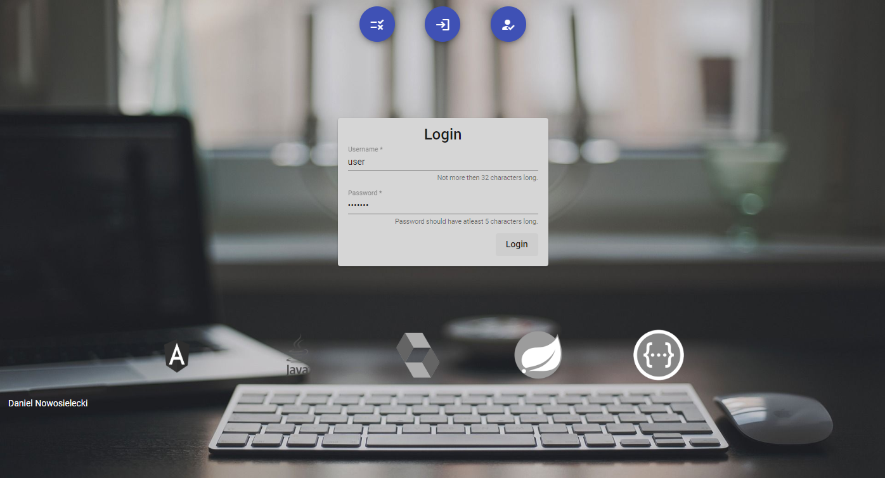

# Do it app
Do it app, is an app where anyone can sign up, and start adding works daily / monthly etc. 

# New Features!

  - Login and register a new account!

You can also:
  - Add, delete, edit your work.
  - Pick work-end date and time.
  - Check your profile data.

### Technologies

Do it app project uses:

* [AngularJS] - HTML enhanced for web apps!
* [Bootstrap] - a little beautify for app.
* [Java] - backend main programming language.
* [Spring Framework] - security and API.
* [node.js] - evented I/O for the backend.
* [REST-API] - to easily exchange data.
* [JWT] - to secure login session.
* [Swagger] - API testing.
* [Lombok] - plugs into editor and build tools features that fasten developing.
* [H2Database] - database for whole service.

### Demo

Login panel




### Installation and setup

Do it app requires [Node.js](https://nodejs.org/) v6+ to run.

To run angular front-end server:

```sh
$ cd ../doitapp
$ npm install
$ npm start
```

   [node.js]: <http://nodejs.org>
   [AngularJS]: <http://angularjs.org>
   [Bootstrap]: <https://getbootstrap.com>
   [Java]: <http://www.java.com>
   [REST-API]: <https://restfulapi.net>
   [Spring Framework]: <http://spring.io>
   [JWT]: <https://jwt.io>
   [Swagger]: <https://swagger.io>
   [Lombok]: <https://projectlombok.org>
   [H2Database]: <http://www.h2database.com>


##
